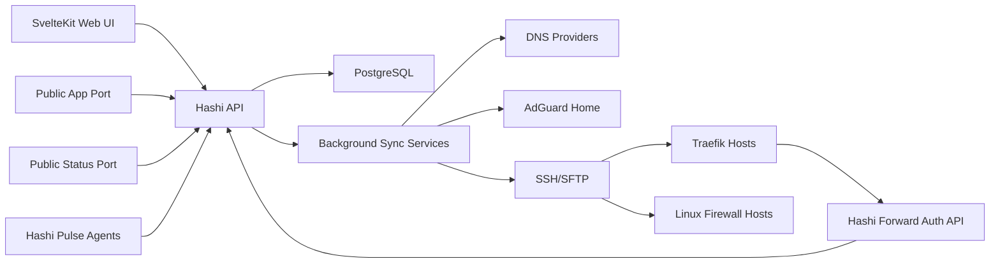

# Hashi V2 Implementation Specification

## 1. Purpose

Hashi V2 is a single-user homelab edge orchestration platform. It manages public and private routing, DNS, reverse-proxy configuration, firewall forwarding, internal DNS rewrites, service health monitoring, public app/status pages, edge SSO, adaptive abuse response, custom host scripts, and lightweight dynamic endpoint discovery.

The product goal is one coherent interface for operating a distributed homelab edge without forcing the user to manually edit DNS zones, Traefik files, firewall scripts, status-page configs, or monitoring definitions in separate places.

This document is the implementation source of truth. The later source note overrides the earlier draft where they conflict.

## 2. Product Principles

Hashi must be:

- Secure by default, with passkey admin authentication, encrypted secrets, audited privileged actions, and conservative destructive operations.
- Lightweight, using proven mainstream libraries and avoiding unnecessary services.
- Idempotent, with every sync producing a desired state, diffing it against current state, and applying only real changes.
- Extensible, with providers behind interfaces and resource models that can accept future DNS, ACME, notification, and reverse-proxy features.
- Usable as a real operations tool, not a demo dashboard. Workflows must be dense, scannable, predictable, and recoverable.
- Honest about risk. If a change can replace configs, open ports, delete DNS records, or block traffic, the UI previews the exact effect before applying it.

## 3. Non-Negotiable Rule Set

1. Hashi owns only objects it created, imported, or the user explicitly assigned to Hashi.
2. Hashi never deletes or modifies DNS `NS` or `SOA` records.
3. Hashi never writes provider state when read-only validation fails.
4. Hashi never uses live provider tests that require creating or deleting production records unless the user explicitly confirms a dry-run plan.
5. Hashi never logs secrets, tokens, private keys, passphrases, recovery keys, session keys, or decrypted provider config.
6. Hashi stores all timestamps in UTC and renders them in the browser locale.
7. Hashi changes Traefik, firewall, DNS, and AdGuard state only through a sync plan with preview, apply, result, and audit log.
8. Hashi writes files atomically: render to temp file, validate, compare content hash, then move into place only if changed.
9. Hashi avoids hot reloads caused by rewriting identical Traefik files.
10. Hashi marks generated resources as system, managed, imported, or user-created.
11. System resources can be edited only through their owning workflow and cannot be deleted while required for app access.
12. Required connection types cannot be deleted below their minimum count.
13. Required minimums are one DNS provider, one Traefik connection, and one Linux firewall host after setup completes.
14. AdGuard Home, notification providers, SSO providers, and dynamic endpoint agents are optional.
15. The frontend uses exactly one main UI component system.
16. The app uses one primary database.
17. Critical security, crypto, SSH, DNS, OIDC, WebAuthn, and YAML parsing use proven libraries or platform APIs.
18. Custom scripts are treated as privileged root-capable operations and require passkey-authenticated approval plus audit logging.
19. Automatically generated firewall rules live in Hashi-specific chains and sets; Hashi never flushes unrelated global firewall state.
20. Every external write adapter must support `Plan`, `Apply`, and `Reconcile` paths.
21. Every setup step can be resumed after restart without leaving the app marked configured until passkey and vault setup are complete.
22. Every background job must expose last run, next run, status, duration, diff summary, and error details.
23. The codebase must pass linters, type checks, tests, dependency audits, secret scanning, and container scanning in Gitea workflows.
24. Passive background sync must continue while no user is logged in. Hashi may queue risky changes for later approval, but routine reconciling cannot depend on an active browser session.

## 4. Tech Stack

### Backend

- Runtime: .NET 10 LTS.
- Language: C# 14 with nullable reference types enabled.
- API: ASP.NET Core Minimal APIs grouped by feature.
- Background jobs: ASP.NET Core hosted services with channel-backed queues and durable job state in PostgreSQL.
- OpenAPI: first-party ASP.NET Core OpenAPI generation.
- Persistence: PostgreSQL 18.
- Data access: EF Core 10 with Npgsql; use raw SQL only for partitioning, advisory locks, and high-volume status/security inserts.
- Validation: FluentValidation or equivalent feature-local validators.
- WebAuthn: Fido2NetLib or an actively maintained equivalent.
- OIDC: Microsoft.AspNetCore.Authentication.OpenIdConnect for upstream identity providers.
- SSH/SFTP: SSH.NET or a maintained equivalent supporting passwords, private keys, and encrypted private keys.
- YAML: YamlDotNet with safe deserialization.
- Scheduling: built-in hosted services for fixed intervals; Cronos for cron expressions.
- Logging: Serilog with structured logs and redaction filters.

### Frontend

- Framework: SvelteKit 5 with TypeScript.
- Main component system: shadcn-svelte, backed by Bits UI primitives.
- Styling: Tailwind CSS v4 plus Hashi theme tokens.
- Icons: lucide-svelte.
- Forms: SvelteKit actions or typed API forms with Zod-compatible schemas generated from OpenAPI where practical.
- Charts: uPlot for status and latency charts.
- Editors: CodeMirror 6 for YAML and shell script editing.
- API client: generated TypeScript types from OpenAPI.
- Tests: Vitest, Testing Library, Playwright.

### Deployment

- Target: Docker Compose.
- Main service: one Hashi container serving the built SvelteKit static app and ASP.NET Core API.
- Database service: PostgreSQL 18.
- Optional mounted volumes:
  - `/data` for uploads, rendered provider plans, GeoIP databases, and local cache.
  - `/logs` for Hashi logs if file logging is enabled.
- Public ports:
  - Admin app: configurable, default `8080`.
  - Public app dashboard: configurable, default `8081`, root path.
  - Public status page: configurable, default `8082`, root path.
- API path: `/api` on the same admin domain.
- Build targets: linux/amd64 and linux/arm64 multi-arch images.

### Dynamic Endpoint Agent

Name: Hashi Pulse.

- Native agent: small static Go binary.
- Docker image: scratch or distroless static image, target compressed size under 10 MB.
- Linux install: one-line command that installs the binary, root-owned config, and a systemd timer or cron fallback.
- Docker install: generated Compose snippet.
- Auth: per-agent scoped token shown once, stored server-side as a hash.

## 5. High-Level Architecture



Hashi is the control plane. Traefik and firewall hosts are the data plane. PostgreSQL stores desired state, observed state, audit history, monitoring samples, security events, and encrypted secrets.

## 6. Core Domain Model

### Connections

Connection types:

- DNS provider.
- Traefik host.
- Linux firewall host.
- AdGuard Home instance.
- OIDC SSO provider.
- Notification provider.
- NetBird management connection, optional.

Every connection has:

- ID, name, type, enabled flag.
- Health state: unknown, validating, healthy, degraded, failed.
- Last validation result and timestamp.
- Encrypted secret references.
- Provider-specific settings in typed JSON.
- Deletion policy: required, optional, system-linked, or safe to remove.

### Resources

Resources describe externally exposed services.

Common fields:

- Name.
- Slug.
- Kind: HTTP, HTTPS, H2C, TCP, UDP.
- Domain mode: root, subdomain, full custom domain.
- Enabled flag.
- System flag.
- Owning feature, if generated by setup.
- Detected Linux firewall host.
- Explicit routing override.
- Dashboard visibility.
- Status monitoring visibility.
- AdGuard rewrite visibility.
- Additional Traefik middlewares.
- Security profile.
- Sync state and last applied hash.

HTTP/H2C/HTTPS fields:

- Simple target: scheme, host, port.
- Advanced routes:
  - Enabled flag.
  - Target list.
  - Path match type: prefix, exact, regex.
  - Path value.
  - Priority.
  - Rewrite rule.
  - Route-specific middleware list.
- Rewrite modes:
  - Replace prefix.
  - Rewrite exact path.
  - Regex replacement with capture groups.
  - Strip prefix.
- TLS options.
- Forward-auth policy.
- Rule list.

TCP/UDP fields:

- Protocol.
- Public port.
- Target host.
- Target port.
- Proxy protocol option for TCP.
- Monitoring protocol hint.

### Resource Rule Model

Rules are evaluated by priority, higher first.

Actions:

- Bypass auth.
- Block access.
- Pass to auth.
- Require adaptive challenge.

Match types:

- IP.
- IP range/CIDR.
- Path.
- Country.
- Region.
- ASN.

Country, region, and ASN matching require a GeoIP database. If unavailable, those rules become invalid with a clear validation error and cannot be enabled.

## 7. Setup Flow

Setup is a resumable state machine.

### 7.1 Bootstrap Access

On first boot:

1. Hashi detects no completed setup.
2. It generates a random bootstrap username and password.
3. It prints them once to Docker logs.
4. It stores only a password hash.
5. It allows bootstrap login only from private/internal ranges by default:
   - `10.0.0.0/8`
   - `172.16.0.0/12`
   - `192.168.0.0/16`
   - `127.0.0.0/8`
   - `::1/128`
   - `fc00::/7`
6. It starts the setup wizard.

Setup is not considered complete until the user reaches Hashi through its final HTTPS domain and registers a working passkey plus recovery key.

### 7.2 Base Settings

Collect:

- Root domain.
- Admin public Hashi domain.
- Internal Hashi URL/IP and port.
- Default sync interval, default one hour.
- Public dashboard enabled flag, default on.
- Public status enabled flag, default on.
- Theme preference.
- Optional asset choices.

### 7.3 DNS Provider Setup

Collect:

- Provider type: Hetzner first.
- API token.
- Zone/domain.
- Default TTL.

Validation:

- Read zones.
- Read records.
- Confirm write capability only if the user permits a harmless dry-run record in a dedicated `_hashi-test` name.

Import:

- Display existing records in a truncating table.
- Do not show raw tokens.
- Let the user select records to import as Hashi-managed manual DNS entries.
- Records not selected can be pruned only after a destructive-change confirmation.
- `NS` and `SOA` records are never pruned.

### 7.4 Certificate Provider Setup

Initial support:

- Google Trust Services ACME.
- Hetzner DNS challenge.

Collect:

- ACME email.
- EAB key ID.
- EAB HMAC.
- DNS provider binding.
- DNS challenge delay.
- Resolver list.

Store ACME secrets encrypted.

### 7.5 Traefik Connection Setup

Collect:

- Name.
- Host/IP.
- SSH username.
- SSH password or private key.
- Private key passphrase if needed.
- Internal Traefik IP.
- Config paths, with detected defaults.

Validation:

- SSH login.
- OS detection: Debian, Ubuntu, Alpine.
- Package manager detection.
- Existing Traefik detection.
- Existing config discovery in common paths.
- Write permission check using a temp file in Hashi-owned path.

If existing configs are found:

- Show files and a summary.
- Offer backup and replacement.
- Require confirmation before Hashi takes ownership.

### 7.6 Linux Firewall Host Setup

Collect:

- Name.
- SSH credentials, same flow as Traefik.
- Managed subnet list, accepting multiple CIDRs.
- Linked Traefik connection.
- Internal Traefik target IP.
- Optional WAN interface override.
- Optional LXC bridge override.
- Optional public IP override.

Validation:

- SSH login.
- OS detection.
- `iptables`, `ipset`, `ip`, `sysctl`, and persistence package availability.
- Public IP detection.
- Managed subnet validation.

### 7.7 Hashi System Resource

Setup creates a system resource for Hashi itself:

- Domain: selected admin public domain.
- Target: internal Hashi app.
- TLS: enabled.
- Security: admin profile.
- Delete: forbidden.
- Edit: only through settings.

Hashi syncs DNS, Traefik, and firewall state, then waits for the user to access the HTTPS domain.

### 7.8 Passkey and Vault Setup

After HTTPS access:

1. User logs in with bootstrap credentials again.
2. User registers a passkey.
3. Browser attempts WebAuthn PRF support.
4. Hashi creates a vault root key.
5. Vault root key is wrapped by passkey-derived key if PRF is available.
6. Hashi also generates a recovery key and requires the user to confirm it.
7. If PRF is unavailable, the recovery key becomes the vault unlock mechanism while the passkey remains the authentication mechanism.
8. Bootstrap credentials are discarded.
9. Setup is marked complete only after a test unlock succeeds.

Important constraint: standard passkeys do not normally expose encryption material. The PRF extension enables passkey-bound encryption when supported. Because support varies by browser/authenticator, the recovery key is mandatory.

### 7.9 Optional Setup Steps

- OIDC SSO provider.
- AdGuard Home connection.
- Notification provider.
- MaxMind account ID and license key for GeoLite2 Country and ASN databases.
- Initial dashboard widgets.

## 8. Secret Storage and Vault Design

Hashi has three classes of secrets:

1. Session-unlocked secrets:
   - Recovery-only vault material.
   - Secret reveal operations.
   - Destructive approval material.
2. Service-sync secrets:
   - SSH credentials.
   - DNS tokens.
   - AdGuard credentials.
   - Notification tokens.
   - ACME EAB secrets.
3. Server-operational secrets:
   - Cookie signing/encryption key.
   - Data protection key material.
   - Database password.

All stored secrets are encrypted at rest with envelope encryption:

- Each secret has a random data encryption key.
- Secret payload uses AES-256-GCM.
- Data encryption keys are wrapped by purpose-specific vault keys.
- Admin vault keys are wrapped by passkey PRF output where supported and by the recovery key.
- Service-sync vault keys are wrapped by a Docker secret or equivalent deployment secret so routine sync can run after restart without a logged-in browser session.
- The service-sync vault can decrypt only secrets required for background reconciliation.
- Passkey login is still required for admin access, viewing/replacing secrets, destructive approvals, changing vault mode, and recovery.
- If the service-sync vault cannot unlock, provider sync jobs pause and surface a critical health warning.
- This tradeoff must be explicit in setup: fully passkey-only encryption is stronger against a server compromise, but it cannot run unattended hourly syncs after restart.

## 9. Authentication and Authorization

Hashi is single-user.

Admin authentication:

- Passkey required after setup.
- Multiple passkeys supported.
- Recovery key required for vault recovery, not for login.
- Admin sessions use secure, HTTP-only cookies.
- CSRF protection on unsafe methods.
- Session timeout configurable.
- Reauthentication required for destructive operations, secret reveal, script changes, and firewall/DNS prune operations.

Public pages:

- App dashboard public port can be enabled or disabled.
- Status page public port can be enabled or disabled.
- Public pages expose only selected records and health summaries.

Edge SSO:

- Hashi supports one or more OIDC identity providers.
- Each protected resource can choose default provider or explicit provider.
- If a default provider is selected, Hashi redirects directly to it.
- Session cookie domain is the root domain, for example `.example.com`, so one login covers subdomains under that root.
- Maximum session length, idle timeout, and remember-device policy are settings.

## 10. Traefik Manager

### 10.1 Installation

Hashi supports Debian, Ubuntu, and Alpine.

Install behavior:

- Detect existing Traefik.
- Detect package manager.
- Install Traefik if absent.
- Create Hashi directories:
  - `/etc/hashi/traefik`
  - `/etc/hashi/traefik/dynamic`
  - `/var/log/hashi/traefik`
  - `/var/lib/hashi/traefik`
- Back up existing configs before replacing.
- Write systemd or OpenRC service config as appropriate.

### 10.2 Static Config

Hashi fully manages Traefik static config.

Static config includes:

- Entry points:
  - `web` on 80/tcp.
  - `websecure` on 443/tcp.
  - Dynamic TCP/UDP entry points for resource ports.
- File provider:
  - Directory mode.
  - Watch enabled.
- ACME resolver:
  - Google Trust Services.
  - Hetzner DNS challenge.
- Access log:
  - JSON format.
  - Minimal useful fields.
  - Sensitive headers redacted.
  - Path: `/var/log/hashi/traefik/access.log`.
- General log:
  - JSON format.
  - Path: `/var/log/hashi/traefik/traefik.log`.
- Ping endpoint.
- Dashboard disabled externally unless explicitly exposed as a protected system resource.
- Plugin definitions pinned by version.

### 10.3 Dynamic Config Files

Hashi writes separate dynamic files:

- `00-hashi-core.yml`: generated default middlewares.
- `10-hashi-http-resources.yml`: generated HTTP/H2C/HTTPS routers and services.
- `20-hashi-stream-resources.yml`: generated TCP/UDP routers and services.
- `30-user-middlewares.yml`: user-editable extra middlewares.
- `40-hashi-security.yml`: generated WAF/rate/security policy.
- `90-hashi-health.yml`: generated health endpoints.

Only `30-user-middlewares.yml` is user-editable through the UI.

The UI parses `30-user-middlewares.yml`, extracts middleware names, validates YAML, and offers valid names as toggles on resources. Parse errors keep the previous applied file and show the error.

### 10.4 Default Middlewares

Generated middlewares:

- HTTP to HTTPS redirect.
- Security headers.
- Compression.
- Hashi forward auth.
- WAF.
- Baseline rate limit.
- Error handling, optional.

The default chain is generated per resource because not every resource needs the same SSO, WAF, or adaptive-auth mode.

### 10.5 Resource Sync Rules

- Every Traefik connection receives every enabled resource.
- DNS decides which Traefik instance receives normal traffic.
- Because all instances know every resource, routing can be changed by DNS without resyncing resource definitions first.
- New public ports require confirmation.
- Removing the last resource using a public port removes the generated entry point and firewall opening after confirmation.
- Disabled resources remain in the database but are removed from generated Traefik files.

### 10.6 TCP and UDP Limits

- UDP routing requires a dedicated entry point per public UDP port.
- TCP routing can use HostSNI only where TLS/SNI makes sense; raw non-TLS TCP should be modeled as port-based routing.
- TCP/UDP resources cannot use HTTP forward auth.
- TCP/UDP abuse handling is done through firewall blocks, local rate controls where available, and log/counter analysis.

## 11. Edge SSO and Forward Auth

Hashi exposes a Traefik forward-auth endpoint:

- `/api/edge-auth/forward`

Traefik sends:

- Original host.
- Original path.
- Method.
- Source IP.
- Forwarded headers.

Hashi returns:

- `204` for allow.
- `401` or redirect for auth required.
- `403` for blocked.
- `429` for rate-limited/challenged traffic.

Policy modes:

- Off: no forward-auth middleware attached.
- SSO required: fail closed if Hashi cannot evaluate.
- Adaptive: Hashi allows anonymous traffic normally, but can require SSO during elevated abuse state.
- Observe: Hashi records decisions without blocking.

Recommended default:

- Attach adaptive forward-auth to all HTTP resources unless explicitly disabled.
- For resources with SSO required, fail closed.
- For resources without SSO required, fail open only when Hashi is unreachable and no active challenge/block policy exists.

This enables adaptive challenge without rewriting Traefik config during an incident.

## 12. HTTP Security and WAF

Hashi uses a prebuilt Traefik WAF middleware based on Coraza and the OWASP Core Rule Set.

Requirements:

- Free.
- No required cloud account.
- Runs locally with Traefik.
- Pinned plugin version.
- Per-resource mode:
  - Off.
  - Detect only.
  - Block.
- Global default:
  - Detect during setup validation.
  - Block for new internet-exposed resources after the user accepts the default security profile.
- Per-resource exclusions for false positives.
- Audit WAF matches into Hashi security events.

Hashi does not implement a WAF engine itself.

## 13. Abuse Detection and Blocking

### 13.1 Signals

Hashi consumes:

- Traefik HTTP access logs.
- Traefik service logs.
- Firewall counters.
- Firewall sampled drop logs.
- Forward-auth decision logs.
- WAF events.
- Manual block entries.

### 13.2 Aggregation

Hashi stores minute buckets by:

- IP.
- Resource.
- Traefik instance.
- Country.
- Region.
- ASN.
- Status code class.
- HTTP method.
- Path prefix.

PostgreSQL partitioning keeps these tables efficient.

### 13.3 Decision States

IP/security subject states:

- Observed.
- Warm.
- Suspect.
- Challenged.
- Soft blocked.
- Firewall blocked.
- Manually allowed.
- Manually blocked.

Default path:

1. High traffic enters suspect.
2. If resource supports adaptive auth, require SSO.
3. If traffic authenticates successfully, raise thresholds for that session but keep WAF active.
4. If traffic continues anonymously or violates WAF/rate thresholds, soft block at edge.
5. For clear malicious IPs, sync to firewall block set.

Authenticated SSO sessions are not globally trusted forever. They get higher thresholds and bypass adaptive challenge for their session, but they do not bypass WAF, explicit blocks, or impossible-volume protection.

### 13.4 Block Types

- IP block:
  - Enforced in Hashi forward auth.
  - Enforced in Traefik config where practical.
  - Enforced in firewall `hashi_blocked` ipset.
- ASN block:
  - Enforced by forward auth.
  - Not expanded to firewall IP ranges by default.
- Country/region block:
  - Enforced by forward auth.
  - Not expanded to firewall IP ranges by default.

Block entries have:

- Scope.
- Reason.
- Source.
- Created by.
- Created at.
- Expiry.
- Last hit.
- Applied-to host list.

## 14. Linux Firewall Host Manager

### 14.1 Desired State

Each Linux firewall host has:

- Name.
- Public FQDN: `name.domain`.
- Public IP.
- Managed internal subnets.
- Linked Traefik connection.
- Internal Traefik IP.
- Route target override.
- SSH credentials.
- OS family.
- WAN interface.
- LXC bridge/interface.
- NetBird enabled flag, default auto-detect.
- NetBird interface, default `wt0`.
- NetBird overlay CIDRs, for example `100.110.0.0/16`.
- NetBird routed-network CIDRs.
- NetBird routing-peer mode.

### 14.2 Generated DNS for Hosts

For each firewall host named `machine1` under `example.com`:

- `machine1.example.com` is an `A` record pointing to that host public IP.
- `via.machine1.example.com` is a `CNAME` to `machine1.example.com`.
- `on.machine1.example.com` is a `CNAME` to `via.machine1.example.com` by default.

Routing override:

- A resource hosted on `machine1` always points to `on.machine1.example.com`.
- The user may configure `on.machine1.example.com` to point to `via.machine2.example.com`.
- This makes traffic for resources on one host enter through another public host.
- AdGuard rewrites never use this override; they always point to the true internal Traefik IP for the detected host.

### 14.3 Firewall Script

Hashi generates and syncs:

- `/opt/hashi/firewall/hashi-firewall.sh`
- `/opt/hashi/firewall/hashi-firewall.env`
- `/etc/cron.d/hashi-firewall` or systemd timer.
- Boot-time service.

The script:

- Detects WAN interface unless configured.
- Detects public IP unless configured.
- Enables IPv4 forwarding.
- Ensures required packages:
  - Debian/Ubuntu: `iptables`, `ipset`, `iptables-persistent`, `netfilter-persistent`.
  - Alpine: `iptables`, `ipset`, `openrc`, persistence fallback.
- Creates/updates ipsets:
  - `hashi_trusted`.
  - `hashi_blocked`.
  - `hashi_netbird`.
- Creates/updates chains:
  - `HASHI_INPUT`.
  - `HASHI_DNAT`.
  - `HASHI_FWD`.
  - `HASHI_POSTROUTING`.
  - `HASHI_NETBIRD`.
- Allows loopback and established traffic.
- Allows all configured managed subnets.
- Allows public IPs of all configured firewall hosts, resolved by `name.domain`.
- Allows current host public IP.
- Allows explicit user allowlist entries.
- Allows trusted NetBird overlay traffic on the configured NetBird interface, equivalent to the current script's `-s VPN_SUBNET -i VPN_IF` behavior.
- Drops blocked IPs before allow rules where appropriate.
- DNATs configured TCP/UDP public ports to linked internal Traefik IP.
- Adds forwarding rules for configured ports.
- Adds NAT masquerade for managed subnets to WAN.
- Adds hairpin NAT for internal access to public endpoints.
- Adds NetBird-to-managed-subnet forwarding and masquerade rules when NetBird support is enabled.
- Adds managed-subnet-to-NetBird forwarding and masquerade rules when the host acts as a NetBird routing peer.
- Adds TCP MSS clamping on NetBird-routed traffic to avoid MTU-related packet loss.
- Saves state with netfilter-persistent where available.

NetBird is not legacy VPN logic in Hashi V2. All firewall hosts are expected to continue using NetBird, so Hashi must manage NetBird compatibility explicitly.

### 14.4 NetBird Support

Hashi manages NetBird compatibility on firewall hosts without fighting NetBird's own host-firewall rules.

Current-script behaviors to preserve:

- Use a configurable overlay interface, default `wt0`.
- Use configurable NetBird overlay CIDRs, with `100.110.0.0/16` as a valid example.
- Allow NetBird overlay source traffic on the NetBird interface before the final input drop.
- Keep atomic ipset refresh behavior for trusted public IPs.
- Keep public-port DNAT to the linked internal Traefik target.
- Keep hairpin NAT for internal access to public endpoints.
- Keep managed-subnet masquerade toward WAN where the host topology needs it.
- Keep `netfilter-persistent save` as the persistence mechanism on Debian/Ubuntu hosts.

NetBird detection:

- Detect whether `netbird` is installed and whether the service is active.
- Detect peer status with `netbird status` when available.
- Detect the NetBird interface, defaulting to `wt0` but allowing override.
- Detect or allow manual entry of the NetBird overlay CIDRs and routed-network CIDRs.
- If Hashi has a NetBird management API connection, it may read peer names, groups, and network resources for display and validation.
- If no NetBird API connection exists, Hashi still supports NetBird locally through SSH detection and user-entered CIDRs.

Modes:

- Peer only: allow NetBird management/access to the host.
- Routing peer: allow NetBird traffic into configured managed subnets.
- Disabled: leave NetBird untouched and do not create NetBird-specific Hashi rules.

Safety:

- Hashi must not flush NetBird-created firewall tables, chains, or nftables rules.
- Hashi must not assume the only interface name is `wt0`.
- Hashi must not require public inbound ports for NetBird itself.
- Hashi must warn before changing rules that could remove NetBird access to a remote host.
- Hashi should install rollback protection for first firewall apply, because losing NetBird access can also mean losing the rescue path.

### 14.5 Safety

- Hashi never edits unrelated user chains.
- Hashi never flushes global chains.
- Hashi removes and recreates only its own chains and set members.
- Before first apply, Hashi shows a firewall diff.
- Hashi schedules a rollback if SSH connectivity is lost during first apply.
- The UI warns before blocking all non-allowed inbound host traffic.

## 15. DNS Provider

### 15.1 Provider Interface

The DNS provider abstraction supports:

- List zones.
- Resolve zone by domain.
- List records.
- Create record.
- Update record.
- Delete record.
- Bulk plan.
- Bulk apply.
- Capability discovery.

Initial provider:

- Hetzner.

Provider design must allow adding Cloudflare, Route53, PowerDNS, and others later without changing resource logic.

### 15.2 DNS Record Types

Manual DNS tab minimum:

- A.
- AAAA.
- CNAME.
- MX.
- TXT.

Provider may expose more supported types if capability discovery is reliable.

### 15.3 Managed Records

Hashi-generated records are hidden from the manual DNS tab by default.

Managed generated records include:

- Host records.
- `via.*` records.
- `on.*` records.
- Resource records.
- ACME challenge records when applicable.
- Ownership marker TXT records if the provider supports safe use for that purpose.

Because not every provider supports comments, Hashi stores ownership in PostgreSQL and uses deterministic naming for generated records.

### 15.4 Resource DNS Behavior

If a resource maps to a detected Linux firewall host:

- Resource DNS record is `CNAME resource.example.com -> on.host.example.com`.

If no Linux firewall host is detected:

- UI requires a manual target IP or Hashi Pulse target.
- Hashi first attempts to match the manual or Pulse IP to a system-managed Linux firewall host, managed subnet, NetBird-routed subnet, or configured host FQDN.
- Only if no host match exists is an A/AAAA record created from that IP.

If a Hashi Pulse target is selected:

- Current internal and public IPs are both evaluated against system-managed hosts.
- If either IP maps to a managed host, public DNS uses `CNAME resource.example.com -> on.host.example.com`.
- If no managed host match exists, current public IP is used for public DNS.
- Current internal IP can be used for internal rewrites when reachable and configured.

### 15.5 Sync Rules

- Compare desired and current records before writes.
- Preserve TTL unless Hashi owns the record or user changes it.
- Never delete unknown records outside an explicit prune workflow.
- Never delete `NS` or `SOA`.
- Treat provider "no changes" responses as successful no-op.

## 16. AdGuard Home Integration

AdGuard Home is optional.

Hashi uses AdGuard Home's control API for DNS rewrites:

- Read current rewrites.
- Add Hashi-managed rewrites.
- Update changed Hashi-managed rewrites.
- Delete stale Hashi-managed rewrites.

Rules:

- Never delete user-created rewrites.
- Use deterministic domain/answer matching plus Hashi ownership state.
- If comments/metadata are unavailable, store ownership in Hashi and avoid touching unknown entries.
- For resources with detected Linux firewall host, rewrite to the true internal Traefik IP.
- Do not use DNS route override for internal rewrites.
- Clean up duplicate Hashi-managed rewrites on sync.

## 17. Hashi Pulse Dynamic Endpoint Agents

Hashi Pulse lets a host report its current address without exposing provider credentials.

### 17.1 Agent Model

Each Pulse agent has:

- Name.
- ID.
- Token hash.
- Install type: Linux service or Docker.
- Allowed scopes.
- Heartbeat interval.
- Last seen.
- Last public IP.
- Last private IP candidates.
- Selected IP.
- Version.
- Status.

### 17.2 Token Rules

- Token is random 256-bit or stronger.
- Token is displayed once.
- Token identifies only one Pulse agent.
- Token can only submit heartbeat data for its own agent.
- Token cannot read config, list resources, or trigger syncs.
- Token can be revoked or rotated.

### 17.3 Heartbeat

Endpoint:

- `POST /api/pulse/{agentId}/heartbeat`

Payload:

- Agent version.
- Hostname.
- Private IPv4/IPv6 candidates.
- Optional user-selected interface.
- Timestamp.
- Optional Docker metadata.

Server records:

- Remote source IP as public IP.
- Private IP candidates after validation.
- Reachability check results.

### 17.4 Resource Use

Resources and manual DNS records can select:

- Manual IP.
- Detected Linux firewall host.
- Hashi Pulse agent.

When a Pulse agent changes IP:

1. Hashi checks whether the reported internal or public IP belongs to a known Linux firewall host, managed subnet, NetBird-routed subnet, or configured host FQDN.
2. If a host match exists, Hashi updates desired DNS to a CNAME pointing at `on.host.example.com`.
3. If no host match exists, Hashi updates desired DNS to an A/AAAA record using the detected public IP.
4. Hashi queues DNS sync.
5. Status page marks related endpoints as pending DNS propagation.

## 18. Status Monitoring

Hashi implements built-in monitoring inspired by Gatus, rather than generating external config.

### 18.1 Endpoint Sources

Endpoints are created from:

- Resources.
- Manual DNS entries with monitoring enabled.
- Linux firewall hosts.
- Traefik connections.
- AdGuard Home connections.
- Hashi itself.
- Optional user-created monitor endpoints.

Name is required for any monitored manual DNS entry.

### 18.2 Check Types

Supported check types:

- HTTP.
- HTTPS.
- H2C where practical.
- TCP.
- UDP basic response checks where configured.
- DNS.
- ICMP when container capabilities allow it.
- TLS certificate expiry.
- Push-based Pulse health.

Auto-detection:

- Prefer explicit resource protocol.
- For DNS entries, probe common ports in safe order.
- Allow per-endpoint override.
- Avoid aggressive scanning.

### 18.3 Status States

- Up: all required checks pass.
- Degraded: partial checks fail, latency threshold exceeded, or only some paths are healthy.
- Down: required checks fail.
- Paused: user paused monitoring.
- Unknown: not enough data.

### 18.4 Data Storage

Tables:

- `monitor_endpoints`.
- `monitor_checks`.
- `monitor_samples_raw`, partitioned by day or week.
- `monitor_rollups_1m`.
- `monitor_rollups_5m`.
- `monitor_rollups_1h`.
- `monitor_events`.

Retention defaults:

- Raw samples: 30 days.
- 1-minute rollups: 90 days.
- 5-minute rollups: 180 days.
- 1-hour rollups: 2 years.

Required views:

- Last 60 minutes bar.
- Last 1 hour latency and uptime.
- Last 24 hours latency and uptime.
- Last 7 days latency and uptime.
- Last 30 days latency and uptime.
- Event timeline.

### 18.5 UI

Status landing page:

- Shows every monitored app/resource as a compact row/card.
- Includes last 60 minutes color strip.
- Shows current state, last check, response time, and group.
- Search.
- Group by host, Linux firewall host, status, or resource type.
- Sort by name, state, latency, uptime, or last event.

Detail page:

- Current status.
- Last check.
- Response time min/max/avg.
- Uptime stats.
- Latency graph.
- Incident/event timeline.
- Endpoint settings.

### 18.6 Notifications

Providers:

- SMTP email.
- Telegram bot.
- Discord bot.

Routing:

- Global defaults.
- Per-endpoint override.
- Severity thresholds.
- Cooldowns.
- Recovery notifications.

Easy setup:

- Telegram: after token entry, ask user to message the bot; use updates to discover chat/channel.
- Discord: short pairing mode can connect to gateway and wait for a DM or mention to capture channel/user ID; manual IDs are always supported.
- SMTP: send test email.

Secrets are stored in the vault.

## 19. Security Dashboard

The Security tab includes a compact dashboard for edge security and abuse visibility. It should be useful without becoming a full SIEM.

Default widgets:

- Allowed requests in the selected time range.
- Blocked requests in the selected time range.
- Challenged requests in the selected time range.
- WAF detections and WAF blocks.
- Firewall-level IP blocks currently active.
- Top 10 blocked IPs with count, last seen, country, ASN, reason, and expiry.
- Top 10 blocked countries by count.
- Top 10 blocked ASNs by count.
- Top 10 resources receiving blocked or challenged traffic.
- Recent security events.

Filters:

- Time range: 1 hour, 24 hours, 7 days, 30 days.
- Resource.
- Traefik instance.
- Linux firewall host.
- Action: allowed, challenged, blocked, WAF-detected.

The dashboard reads from the same security buckets and blocklist tables used by abuse detection. It should not introduce a separate analytics store.

## 20. Public App Dashboard

The app dashboard is a Heimdall-style public view generated from selected entries.

Sources:

- Resources with dashboard enabled.
- Manual DNS entries with dashboard enabled.

Requirements:

- Resources created inside Hashi use the resource name as the default dashboard display name.
- Manually managed external DNS entries require a display name before dashboard display can be enabled.
- Cards link to the public URL.
- Search is collapsed by default.
- Sort selector.
- Show `x / n hosts online`.
- Show `x / n Linux firewall hosts available`.
- Public root path on its own port, enabled by default.
- No admin controls on public page.

## 21. Admin UI Information Architecture

Navigation:

- Overview.
- Resources.
- DNS.
- Traefik.
- Firewall Hosts.
- Pulse.
- Status.
- App Display.
- Security.
- Scripts.
- Connections.
- Activity.
- Settings.

Layout:

- Left collapsed rail.
- Hover expands.
- Pin button keeps it open.
- Overview widgets can be toggled and reordered in settings.

Default overview widgets:

- Resource health summary.
- Linux firewall host availability.
- Traefik sync state.
- DNS sync state.
- Recent incidents.
- Active security events.
- Pending sync changes.
- Certificate expiry warnings.
- Vault lock state.
- Recent audit entries.

## 22. Visual Design

### Theme

Dark theme is based on Shades of Purple:

- Background: `#2D2B55`.
- Background dark: `#1E1E3F`.
- Foreground: `#A599E9`.
- Hover background: `#4D21FC`.
- Contrast: `#FAD000`.
- Highlight: `#FF7200`.
- Status success green must harmonize with the palette.

Light theme:

- Bright pink/violet direction.
- High contrast.
- Not beige, not washed out, not monochrome.

### UI Rules

- Dense operational layout.
- No marketing landing page.
- Cards only for repeated items, modals, and framed tools.
- No nested cards.
- No decorative gradient blobs.
- Use icons for tool buttons.
- Use stable sizes for tables, rows, port chips, status strips, and action buttons.
- Text must not overflow its controls.
- Tooltips for unfamiliar icons.
- The app should feel fast and precise.

### Assets

Default assets can be fetched from `https://static.juzo.io/` and cached locally:

- Icons:
  - `/icon/default/`
  - `/icon/bloom/`
- Logos:
  - `/logo/2k/`
  - `/logo/4k/`
- Backgrounds:
  - `/background/2k/`
  - `/background/4k/`
- Media:
  - `/media/chillwave-mix.mp3`

Use logos/icons by default. Backgrounds are optional and should not reduce dashboard readability. Settings allow replacing all assets.

## 23. Custom Shell Scripts

The Scripts tab allows creating privileged scripts for Linux firewall hosts.

Fields:

- Name.
- Description.
- Shell script body.
- Enabled flag.
- Optional cron expression.
- Target hosts, default all Linux firewall hosts.
- Run timeout.
- Environment variables, encrypted where secret.
- Manual trigger.

Sync behavior:

- Scripts are written to `/opt/hashi/scripts`.
- Root-owned, not world-writable.
- Hashi writes a manifest with script hashes.
- Cron entries are generated in `/etc/cron.d/hashi-scripts` or systemd timers.
- Manual runs execute through SSH.
- Output is captured, redacted, and stored.

Safety:

- Saving or running a script requires reauthentication.
- UI shows target hosts and diff before applying.
- Scripts cannot run if vault is locked and credentials are needed.
- Every run produces an audit entry.

## 24. Settings

Settings categories:

- General:
  - Root domain.
  - Admin domain.
  - Default sync interval.
  - Timezone display preference.
- Security:
  - Session duration.
  - Edge SSO session length.
  - Adaptive auth defaults.
  - WAF defaults.
  - Block TTLs.
  - GeoIP update settings.
- Appearance:
  - Theme.
  - Logo.
  - Icon.
  - Public page assets.
  - Widget order.
- Monitoring:
  - Default interval.
  - Timeout.
  - Allowed HTTP codes.
  - Latency thresholds.
  - Retention.
  - Public status enabled.
- Dashboard:
  - Public dashboard enabled.
  - Default sort.
  - Visibility defaults.
- DNS:
  - Default TTL.
  - Prune policy.
  - Import behavior.
- Traefik:
  - Config paths.
  - Log paths.
  - ACME defaults.
  - Middleware file editor settings.
- Firewall:
  - Trusted CIDRs.
  - Default port confirmation behavior.
  - Persistence mode.
  - NetBird support default.
  - NetBird interface default.
  - NetBird routed-network behavior.
  - NetBird MSS clamping toggle.
- Notifications:
  - Default provider.
  - Cooldowns.
- Pulse:
  - Heartbeat interval.
  - Stale threshold.

## 25. Sync Engine

Hashi uses a plan/apply/reconcile model.

Plan:

- Load desired state from PostgreSQL.
- Load current provider state.
- Normalize both.
- Compute diff.
- Mark risk level.
- Render file changes in memory.
- Validate generated configs.

Apply:

- Acquire advisory lock per provider/connection.
- Recheck current state if plan is stale.
- Apply low-risk changes automatically on save.
- Require confirmation for destructive/high-risk changes.
- Write files atomically.
- Run remote validation.
- Restart/reload services only if needed.

Reconcile:

- Verify applied state.
- Update last applied hashes.
- Store result and audit log.
- Queue dependent syncs.

Default periodic sync:

- Every hour.
- Immediate sync after save.
- Manual sync button per subsystem and global.

Passive sync and confirmations:

- Routine syncs run on the server regardless of whether a user is logged in.
- Secrets needed by routine syncs must be available to the server after startup through a clearly documented operational vault mode.
- The default production mode should use a server-side service vault key supplied as a Docker secret, combined with the database-stored encrypted secret envelopes.
- Passkey login still protects admin access, destructive approvals, secret reveal, and recovery.
- User-confirmation requirements are attached to high-risk actions, not to the background sync loop itself.
- If a passive sync discovers a high-risk required change, it records a pending plan and continues applying safe changes.
- Pending high-risk plans are shown on login and can also trigger notifications.

## 26. Database Schema Outline

Core:

- `app_settings`
- `setup_state`
- `audit_events`
- `connections`
- `connection_health`
- `secret_records`
- `vault_wrapped_keys`
- `sync_runs`
- `sync_steps`
- `sync_diffs`

Resources:

- `resources`
- `resource_routes`
- `resource_targets`
- `resource_rules`
- `resource_middlewares`
- `resource_ports`
- `system_resources`

DNS:

- `dns_zones`
- `dns_records`
- `dns_record_ownership`
- `dns_import_decisions`

Traefik:

- `traefik_hosts`
- `traefik_generated_files`
- `traefik_user_middlewares`
- `traefik_entrypoints`

Firewall:

- `firewall_hosts`
- `firewall_subnets`
- `firewall_netbird_settings`
- `firewall_ports`
- `firewall_allowed_subjects`
- `firewall_block_subjects`
- `firewall_generated_scripts`

Security:

- `edge_sessions`
- `oidc_providers`
- `security_events`
- `security_subjects`
- `security_request_buckets`
- `blocklist_entries`
- `geoip_databases`
- `security_dashboard_snapshots`

Monitoring:

- `monitor_endpoints`
- `monitor_checks`
- `monitor_samples_raw`
- `monitor_rollups_1m`
- `monitor_rollups_5m`
- `monitor_rollups_1h`
- `monitor_events`
- `notification_providers`
- `notification_routes`
- `notification_deliveries`

Pulse:

- `pulse_agents`
- `pulse_heartbeats`
- `pulse_tokens`

Scripts:

- `host_scripts`
- `host_script_targets`
- `host_script_runs`
- `host_script_outputs`

Use `jsonb` for provider-specific fields but keep core operational fields relational.

## 27. API Surface

Admin API:

- `/api/setup/*`
- `/api/auth/passkeys/*`
- `/api/auth/session/*`
- `/api/vault/*`
- `/api/connections/*`
- `/api/resources/*`
- `/api/dns/*`
- `/api/traefik/*`
- `/api/firewall/*`
- `/api/adguard/*`
- `/api/pulse/*`
- `/api/status/*`
- `/api/dashboard/*`
- `/api/security/*`
- `/api/security/dashboard`
- `/api/scripts/*`
- `/api/settings/*`
- `/api/sync/*`
- `/api/activity/*`

Edge API:

- `/api/edge-auth/forward`
- `/api/edge-auth/login`
- `/api/edge-auth/callback`
- `/api/edge-auth/logout`

Public API:

- `/api/public/apps`
- `/api/public/status`

Agent API:

- `/api/pulse/{agentId}/heartbeat`

All unsafe admin endpoints require CSRF protection. High-risk endpoints require recent reauthentication.

## 28. Repository Structure

```text
hashi/
  src/
    Hashi.Api/
      Features/
      Program.cs
      appsettings.json
    Hashi.Core/
      Auth/
      Connections/
      Dns/
      Firewall/
      Monitoring/
      Resources/
      Security/
      Sync/
    Hashi.Infrastructure/
      Persistence/
      Providers/
      Ssh/
      Traefik/
      Crypto/
      Notifications/
    Hashi.Contracts/
      Api/
      Events/
  web/
    src/
      lib/
      routes/
      app.css
    components.json
    package.json
  agents/
    pulse/
      cmd/hashi-pulse/
      internal/
      Dockerfile
  deploy/
    compose/
      docker-compose.yml
      docker-compose.dev.yml
    traefik-templates/
    firewall-templates/
  tests/
    Hashi.UnitTests/
    Hashi.IntegrationTests/
    Hashi.E2ETests/
    fixtures/
  docs/
    adr/
    operations/
    security/
  .gitea/
    workflows/
      ci.yml
      security.yml
      docker-build.yml
  Directory.Build.props
  Hashi.sln
```

## 29. Development Workflow

- Use feature branches.
- Use small commits.
- Use conventional commit messages.
- Keep migrations in the same commit as model changes.
- Add or update tests with every behavior change.
- Add ADRs for major architecture decisions.
- Never commit real secrets or local provider configs.
- Use fixtures and fake providers for tests.
- Use dry-run provider adapters for local development.
- Keep generated OpenAPI and frontend types updated in the same change.

## 30. CI/CD

Gitea workflows:

### CI

- Restore .NET.
- Restore pnpm.
- Run `dotnet format --verify-no-changes`.
- Run backend analyzers.
- Run backend unit tests.
- Run integration tests with PostgreSQL test container.
- Run frontend lint.
- Run frontend type check.
- Run Svelte check.
- Run frontend unit tests.
- Build frontend.
- Build backend.
- Generate OpenAPI and verify committed client types if committed.

### Security

- gitleaks secret scan.
- Semgrep or equivalent SAST.
- `dotnet list package --vulnerable`.
- pnpm audit or OSV scanner.
- Trivy filesystem scan.
- Trivy container image scan.

### Docker Build

- Build linux/amd64 and linux/arm64.
- Push to `git.juzo.io/juzo/hashi`.
- Tags:
  - `latest` for main.
  - commit SHA.
  - semantic version tags.
- Use build cache.

## 31. Test Strategy

Unit tests:

- Domain validation.
- DNS diffing.
- Traefik render output.
- Firewall render output.
- Rule evaluation.
- Vault wrapping/unwrapping.
- Status rollups.
- Abuse scoring.

Integration tests:

- PostgreSQL migrations.
- Sync plan persistence.
- Hetzner fake API.
- AdGuard fake API.
- SSH/SFTP test container.
- Traefik config validation container.
- OIDC fake provider.
- SMTP fake server.

E2E tests:

- First setup flow.
- Passkey registration with browser-supported test harness.
- Resource creation.
- DNS import.
- Middleware editor validation.
- Status page public view.
- App dashboard public view.
- Custom script save/manual run flow with fake host.

Safety tests:

- NS/SOA deletion impossible.
- Unowned records untouched.
- Identical Traefik file not rewritten.
- Firewall generated chains do not flush unrelated rules.
- NetBird-created rules are preserved.
- NetBird interface access survives Hashi firewall apply.
- Pulse target IPs matching managed hosts produce CNAMEs, not A records.
- Secret redaction in logs and API responses.
- Passive sync runs without an active web session.
- High-risk passive sync plans wait for user approval.

## 32. Implementation Plan

### Phase -1: Preserve V1 and Start Clean

- Work inside the original `git.juzo.io/juzo/hashi` repository.
- Before creating V2 files, move all existing V1 implementation files into `hashi.old/`.
- Preserve V1 history through git, but keep V1 code out of the active source tree.
- Add `hashi.old/README.md` explaining that it is historical reference only and must not be imported into V2 code.
- Start the V2 solution, frontend, agents, tests, deploy files, and docs from scratch at the repository root.
- Do not copy V1 JavaScript modules into V2.
- Use V1 only as behavioral reference for topology, DNS sync, status generation lessons, and idempotent write behavior.

Exit criteria:

- Existing V1 files are under `hashi.old/`.
- Root contains only V2 scaffolding plus repository metadata.
- CI ignores `hashi.old/` except for optional archive lint exclusions.

### Phase 0: Repo Foundation

- Create solution and project structure.
- Create SvelteKit app.
- Add Docker Compose for Hashi and PostgreSQL.
- Add Gitea CI baseline.
- Add formatting, linting, and test scaffolding.
- Add ADR for database and deployment model.

Exit criteria:

- Empty app builds.
- CI passes.
- Docker Compose starts.

### Phase 1: Persistence, Settings, and Setup State

- Add PostgreSQL migrations.
- Add setup state machine.
- Add app settings.
- Add audit events.
- Add sync run schema.
- Add typed provider result model.

Exit criteria:

- Setup state persists and resumes.
- Audit log works.

### Phase 2: Admin Auth, Passkeys, and Vault

- Implement bootstrap credentials.
- Implement internal-range bootstrap restriction.
- Implement passkey registration/login.
- Implement WebAuthn PRF attempt.
- Implement recovery-key vault fallback.
- Implement encrypted secret records.
- Implement vault lock/unlock behavior.

Exit criteria:

- Setup cannot complete without passkey and vault.
- Secrets remain unreadable in DB dumps.
- Routine provider jobs can unlock through the service-sync vault without an active browser session.
- Jobs needing secrets pause only when the required service-sync vault cannot unlock.

### Phase 3: DNS Provider and Import

- Implement DNS provider interface.
- Implement Hetzner adapter.
- Implement read-only validation.
- Implement import table.
- Implement DNS diff plan.
- Implement safe apply.
- Add generated host record logic.

Exit criteria:

- Existing records can be imported.
- Generated records are planned correctly.
- NS/SOA deletion tests pass.

### Phase 4: SSH and Host Connections

- Implement SSH credential storage.
- Implement SSH validation.
- Implement OS detection.
- Implement remote file write with atomic move.
- Implement connection health.

Exit criteria:

- Test containers validate SSH flows.
- Password, key, and encrypted key paths work.

### Phase 5: Traefik Manager

- Implement Traefik static config renderer.
- Implement dynamic config renderers.
- Implement user middleware editor and parser.
- Implement resource-to-router/service rendering.
- Implement config validation.
- Implement install/backup flow.

Exit criteria:

- HTTP and TCP/UDP resources render.
- Identical files are not rewritten.
- Existing config warning flow works.

### Phase 6: Resource Management

- Build Resources UI.
- Implement simple and advanced HTTP targets.
- Implement path matching and rewrite options.
- Implement TCP/UDP resources.
- Implement port confirmation.
- Implement system resources.
- Implement status/dashboard toggles.

Exit criteria:

- User can create, edit, disable, and sync resources.
- Required system resource cannot be deleted.

### Phase 7: Firewall Host Manager

- Implement firewall host model.
- Implement firewall script renderer.
- Implement ipset/blocklist renderer.
- Implement NetBird detection and NetBird firewall compatibility profile.
- Implement cron/boot persistence.
- Implement rollback safety.
- Implement public IP allowlist by host FQDN.

Exit criteria:

- Generated script passes shellcheck.
- Test host applies only Hashi chains.
- Port forwarding plan matches resources.
- NetBird access and routed traffic continue working after Hashi applies firewall state.

### Phase 8: Public Dashboard and Status Monitoring

- Implement monitor endpoint model.
- Implement check workers.
- Implement raw sample partitions.
- Implement rollups.
- Implement public status port.
- Implement app dashboard public port.
- Implement dashboard/status settings.

Exit criteria:

- Last 60-minute strip and detail graphs work.
- Public pages expose only selected data.

### Phase 9: Edge SSO

- Implement OIDC provider setup.
- Implement forward-auth endpoint.
- Implement resource rule evaluation.
- Implement cross-subdomain session cookie.
- Implement SSO settings.
- Implement adaptive-auth mode.

Exit criteria:

- One SSO login covers resources on the same root domain.
- Rule actions work by IP, CIDR, path, country, region, and ASN where data exists.

### Phase 10: WAF and Abuse Response

- Add Coraza/OWASP CRS middleware generation.
- Add WAF mode per resource.
- Add access-log ingestion.
- Add security buckets.
- Add abuse scoring.
- Add adaptive challenge.
- Add blocklist sync to firewall.
- Add security UI.
- Add compact security dashboard widgets for allowed, challenged, blocked, top IPs, top countries, and top ASNs.

Exit criteria:

- High-volume anonymous traffic can trigger challenge.
- IP blocks reach all firewall hosts.
- WAF events appear in audit/security timelines.

### Phase 11: AdGuard Home

- Implement AdGuard connection.
- Implement rewrite list/add/update/delete.
- Implement safe ownership handling.
- Implement internal rewrite sync.

Exit criteria:

- Hashi rewrites sync without touching manual rewrites.

### Phase 12: Hashi Pulse

- Implement Pulse API.
- Implement Go agent.
- Implement Linux installer.
- Implement Docker snippet.
- Implement resource/DNS target integration.
- Implement managed-host matching before A/AAAA record creation.

Exit criteria:

- Pulse IP changes queue DNS sync.
- Pulse IPs that match managed hosts generate CNAMEs to `on.host.example.com`.
- Revoked token cannot submit heartbeat.

### Phase 13: Notifications and Scripts

- Implement SMTP, Telegram, Discord.
- Implement notification routing.
- Implement script editor.
- Implement cron sync.
- Implement manual script execution.

Exit criteria:

- Alerts send and recover.
- Script runs are audited and output captured.

### Phase 14: Hardening and Release

- Threat model review.
- Full CI hardening.
- E2E setup test.
- Backup/restore documentation.
- Operations docs.
- Release image.

Exit criteria:

- Fresh Docker Compose setup works end to end.
- Security scans pass or have documented accepted risk.

## 33. Operations Guidance

Backups:

- PostgreSQL backup is mandatory.
- `/data` backup is mandatory for GeoIP DB cache, uploads, and local generated artifacts.
- Recovery key must be stored outside Hashi.

Disaster recovery:

- Restore PostgreSQL and `/data`.
- Start Hashi.
- Unlock vault with passkey or recovery key.
- Run global reconcile.

When locked:

- Public pages still render last known state.
- Monitoring checks that need no secrets may continue.
- Provider syncs continue in service-sync vault mode.
- Provider syncs pause only if service-sync vault mode is disabled or the service-sync vault cannot unlock.
- Firewall last applied state remains active.

## 34. V1 Lessons to Preserve

The V1 codebase already contains useful ideas:

- Topology mapping from host names to subnets.
- DNS sync history.
- Live log streaming.
- Config masking.
- Gatus-style endpoint generation.
- Avoiding writes when generated content is unchanged.

V2 should preserve the behavior, not the architecture. V2 should replace file-based config as the primary state store with PostgreSQL desired state and provider-specific sync plans.

## 35. Reference Links

- [.NET 10 support policy](https://dotnet.microsoft.com/platform/support-policy)
- [ASP.NET Core OpenAPI support](https://learn.microsoft.com/en-us/aspnet/core/fundamentals/openapi/overview?view=aspnetcore-10.0)
- [PostgreSQL 18 release](https://www.postgresql.org/about/news/postgresql-18-released-3142/)
- [Svelte docs](https://svelte.dev/docs/svelte/overview)
- [shadcn-svelte docs](https://www.shadcn-svelte.com/docs)
- [Bits UI docs](https://www.bits-ui.com/docs)
- [Lucide icons](https://lucide.dev/)
- [Traefik file provider](https://doc.traefik.io/traefik/master/reference/install-configuration/providers/others/file/)
- [Traefik forward auth](https://doc.traefik.io/traefik/v3.4/middlewares/http/forwardauth/)
- [Traefik rate limit](https://doc.traefik.io/traefik/v3.4/middlewares/http/ratelimit/)
- [Traefik Coraza WAF plugin](https://plugins.traefik.io/plugins/65f2aea146079255c9ffd1ec/coraza-waf)
- [Hetzner DNS API docs](https://dns.hetzner.com/api-docs/)
- [AdGuard Home OpenAPI](https://github.com/AdguardTeam/AdGuardHome/blob/master/openapi/openapi.yaml)
- [Gatus endpoint model](https://gatus.io/docs/endpoints)
- [MDN WebAuthn](https://developer.mozilla.org/en-US/docs/Web/API/Web_Authentication_API)
- [MDN WebAuthn extensions and PRF](https://developer.mozilla.org/docs/Web/API/Web_Authentication_API/WebAuthn_extensions)
- [MaxMind GeoLite2 database docs](https://dev.maxmind.com/geoip/docs/databases/)
- [MaxMind database update docs](https://dev.maxmind.com/geoip/updating-databases)
- [NetBird routing peers](https://docs.netbird.io/manage/networks/how-routing-peers-work)
- [NetBird ports and firewalls](https://docs.netbird.io/about-netbird/ports-and-firewalls)
- [NetBird CLI](https://docs.netbird.io/get-started/cli)
- [Hashi static asset host](https://static.juzo.io/)
